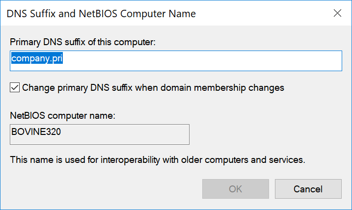

# DNSSuffix
This PowerShell module has two simple commands to that work with the registry to either get or set the primary DNS suffix of a computer. This is not the value you can configure on a per network adapter configuration. Instead this is the setting you see when you go into Advanced System properties to change the computer name. When you like the More... button you get a form like this:

This value is maintained in the registry under  HKLM:\system\CurrentControlSet\Services\tcpip\parameters where you must change the Domain and NV Domain properties. You can also configure whether to synchronize the DNS suffix with domain member ship changes. The commands in this module allow you to set and get those values using PowerShell Remoting.

I put this module together after helping [Greg Shields](http://twitter.com/ConcentratdGreg) work through this very issue as there don't appear to be any existing PowerShell commands to handle this setting.

You can install this module from the PowerShell Gallery: `Install-Module DNSSuffix`

*last updated 1 February, 2018*